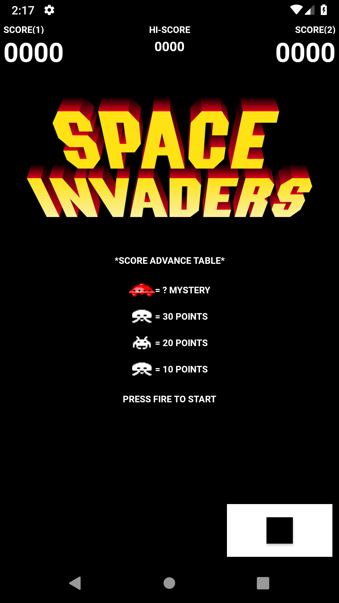
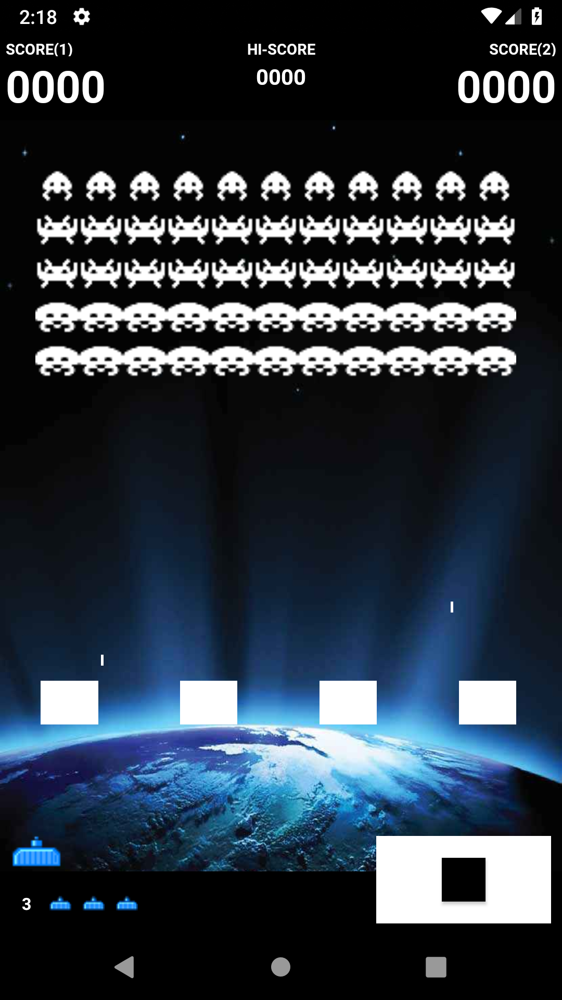
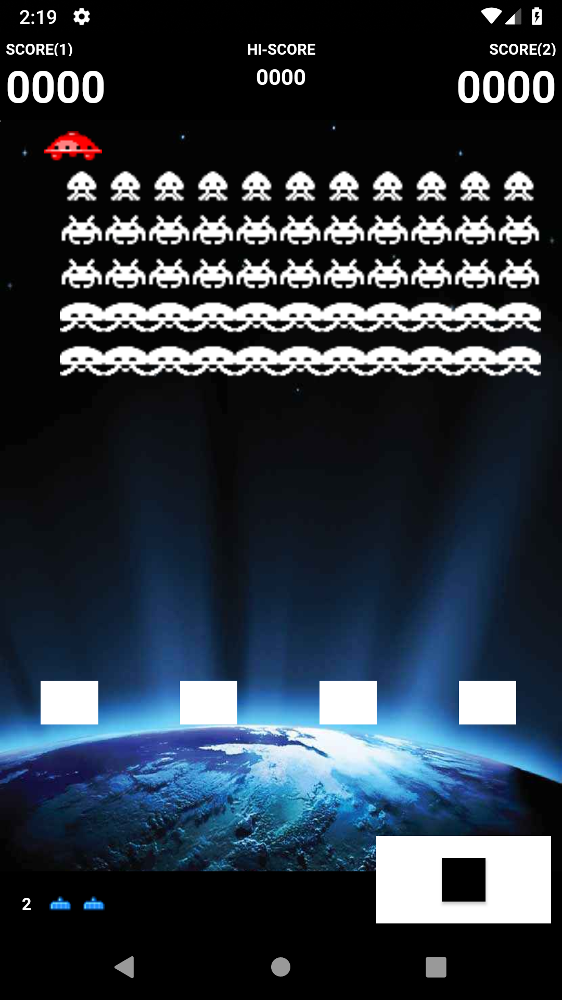

# Space Invaders for Android

An Android implementation of the classical arcade game [Space Invaders](https://en.wikipedia.org/wiki/Space_Invaders). This version is a port of the [Space Invaders for Delphi](https://github.com/miselkrstovic/space-invaders-delphi) project.

### Screenshots

  

### Prerequisites

No special setup is required, since Android Studio will automatically download all required libraries as defined in the dependencies section of the _build.gradle_ file.

### Controls

Key | Usage
----|-----
<kbd>&larr;</kbd>, <kbd>&rarr;</kbd> | Move the tank to the left or to the right accordingly
<kbd>Start/Space</kbd> | Launch a missile
<kbd>Select</kbd> | Pause the game
<kbd>Back</kbd> | Quit the game

## More work

There are still a lot of missing features, and bugs to be squashed. For the curious they can be found in the [TODO](TODO.md) file.

## Acknowledgment

https://commons.wikimedia.org/wiki/File:Space_invaders_logo.svg

## Contributing

There are still a lot of missing features, and bugs to be squashed. For the curious they can be found in the [TODO](TODO.md) file.

Please take a look at the [contributing](CONTRIBUTING.md) guidelines if you're interested in helping!

## License

Space Invaders for Android is released under the MIT license.
See [LICENSE](./LICENSE.md) for details.
